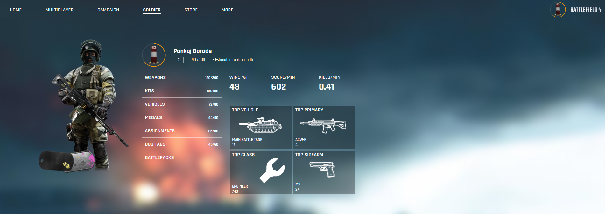

# Battlefield Soldier
Battlefield Soldier - It is one of the tasks in Round 1 of the FOG Tech Challenge. The objective is to replicate the soldier section of the [webpage](https://battlefield-4-webflow-rebuild.webflow.io/game?tab=tab-soldier) using React.js for the frontend and Node.js for the backend.

### Task Completed:
1. Built the Battlefield 4 SOLDIER frontend page as per given design.
2. Fetched data from MongoDB in backend to frontend using custom API and used it in the Soldier menu.
3. Implemented hover effects and ensured responsiveness for a seamless user experience.

## Follow below steps to test
Deployed link: [here](https://battlefield-pb.netlify.app/)

Or 

For Frontend:
cd battlefield
npm install
npm start

For Backend:
cd backend
npm install
nodemon index.js

## Image
Soldier Menu

For any queries contact me at borade.keshav825@gmail.com
